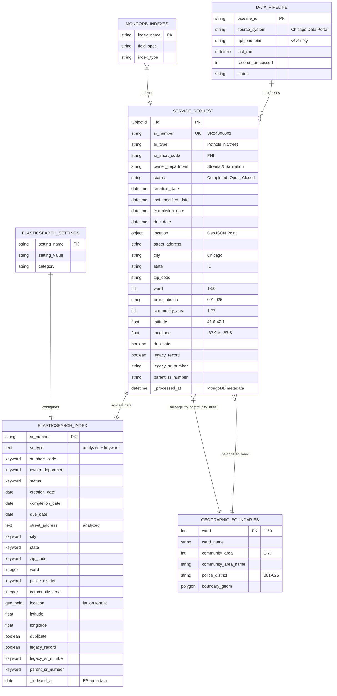

# Chicago 311 Data Platform - ERD Diagram

## Entity Relationship Diagram



## Data Model Details

### MongoDB Collection: `service_requests`

**Primary Collection Structure:**
- **Document-based storage** with embedded location data
- **GeoJSON format** for spatial queries
- **Compound indexes** for performance optimization
- **Bulk operations** support for ETL processes

**Key Indexes:**
- Single: `sr_number`, `creation_date`, `status`, `sr_type`, `ward`
- Geospatial: `location` (2dsphere)
- Compound: `{status: 1, creation_date: -1}`, `{sr_type: 1, creation_date: -1}`
- Text: `{sr_type: "text", street_address: "text"}`

### Elasticsearch Index: `chicago_311`

**Search-Optimized Structure:**
- **Multi-field mappings** (text + keyword)
- **Custom analyzers** for address and service type search
- **Geo-point mapping** for spatial queries
- **Synonym filters** for address normalization

**Performance Settings:**
- 3 shards, 1 replica
- 30s refresh interval
- 50,000 max result window
- Custom Chicago-specific analyzer

### Data Transformation Pipeline

**Source → MongoDB:**
```
Chicago Data Portal API
    ↓ (Extract)
Raw JSON Data
    ↓ (Transform)
- Convert coordinates to GeoJSON
- Parse dates to datetime objects
- Validate geographic boundaries
- Add processing metadata
    ↓ (Load)
MongoDB Collection
```

**MongoDB → Elasticsearch:**
```
MongoDB Document
    ↓ (Transform)
- Convert GeoJSON to geo_point
- Apply field mappings
- Add indexing metadata
    ↓ (Index)
Elasticsearch Document
```

### Geographic Relationships

**Administrative Boundaries:**
- **Ward**: 1-50 (City Council districts)
- **Community Area**: 1-77 (Neighborhood boundaries) 
- **Police District**: 001-025 (CPD jurisdictions)

**Coordinate System:**
- **Projection**: WGS84 (EPSG:4326)
- **Valid Range**: 
  - Latitude: 41.6°N to 42.1°N
  - Longitude: 87.9°W to 87.5°W

### Data Quality and Constraints

**Validation Rules:**
- Service request numbers must be unique
- Coordinates must fall within Chicago boundaries
- Dates must follow chronological order (creation ≤ completion)
- Status values restricted to predefined set
- Department names normalized to standard list

**Data Integrity:**
- Primary key: `sr_number` (unique across both systems)
- Foreign key relationships through geographic boundaries
- Referential integrity maintained during ETL process
- Duplicate detection and handling

## System Architecture

### Dual-Database Strategy

**MongoDB (Operational)**:
- Document storage for complex nested data
- ACID transactions for data consistency
- Geospatial indexing for location queries
- Optimized for writes and complex aggregations

**Elasticsearch (Analytics)**:
- Full-text search capabilities
- Real-time analytics and dashboards
- Faceted search and aggregations
- Optimized for reads and search operations

### Synchronization

- **Near real-time sync** between MongoDB and Elasticsearch
- **Change stream processing** for incremental updates
- **Bulk indexing** for initial data loads
- **Consistency checks** and reconciliation processes